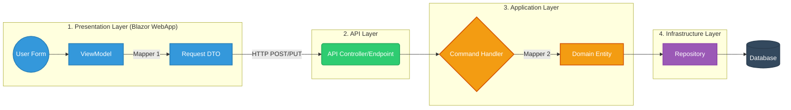

Trong một hệ thống tách biệt hoàn toàn giữa **WebApp (Blazor)** và **API**, việc có **2 Mapper** là điều hiển nhiên và đúng chuẩn của **Clean Architecture**.

### 1. Đánh giá quy trình:

Quy trình hiện tại:

> `User Input -> ViewModel -> [Mapper 1] -> DTO -> API -> Handler -> [Mapper 2] -> Entity -> Repo -> DB`

**Đánh giá:** * **Về mặt lý thuyết (Sách giáo khoa):** Tuyệt đối chuẩn! Nó phân tách rõ ràng trách nhiệm. WebApp chỉ biết ViewModel và DTO. API chỉ biết DTO và Entity. Không thằng nào giẫm chân lên thằng nào. Đổi Database không ảnh hưởng đến UI, đổi UI không ảnh hưởng đến DB.

### 2. Sơ đồ Mermaid chuẩn xác nhất

Dưới đây là sơ đồ dòng chảy dữ liệu (Data Flow) khi người dùng gửi một Request (ví dụ: Tạo Project mới). Bạn có thể copy đoạn code dưới đây dán vào Github, Notion hoặc [Mermaid Live Editor](https://mermaid.live/) để xem nhé:

---

### 3. Giải thích quy trình (Present)

Co 4 chặng:

1. **Trạm 1 (Gom dữ liệu):** Người dùng nhập form. Dữ liệu chạy vào `ViewModel` (Chứa các rule validate UI). Sau đó, **Mapper 1** sẽ nén cái `ViewModel` đó thành một cái bưu kiện gọn nhẹ gọi là `Request DTO` để gửi qua mạng.
2. **Trạm 2 (Vận chuyển):** `DTO` được gửi qua môi trường Internet (HTTP) bay đến cổng `API`.
3. **Trạm 3 (Xử lý nghiệp vụ):** API giao bưu kiện `DTO` cho `Handler` (giống như quản đốc). Handler gọi **Mapper 2** để dịch cái `DTO` đó thành `Entity` (Thực thể lõi mà hệ thống hiểu).
4. **Trạm 4 (Lưu trữ):** `Entity` được ném cho `Repository` (kho bãi). Repo dùng Entity Framework dịch ra câu lệnh SQL và lưu vào `Database`.

