Chiều lấy dữ liệu (Read/Query) có một điểm cực kỳ "ăn tiền" và khác biệt so với chiều lưu (Write/Command), đó chính là sự xuất hiện của **`.ProjectTo()`** giúp tối ưu hóa hiệu năng Database.

### 1. Sơ đồ Mermaid (Quy trình lấy dữ liệu từ DB lên UI)

Mình vẽ theo chiều từ phải sang trái (DB -> UI) để bạn dễ hình dung sự dội ngược lại của dữ liệu nhé. Copy đoạn này vào Mermaid Live:

```mermaid
graph RL
    %% Định nghĩa Style
    classDef ui fill:#3498db,stroke:#2980b9,color:#fff,stroke-width:2px;
    classDef api fill:#2ecc71,stroke:#27ae60,color:#fff,stroke-width:2px;
    classDef core fill:#f39c12,stroke:#d35400,color:#fff,stroke-width:2px;
    classDef infra fill:#9b59b6,stroke:#8e44ad,color:#fff,stroke-width:2px;
    classDef db fill:#34495e,stroke:#2c3e50,color:#fff,stroke-width:2px;

    %% Database & Infra Layer
    subgraph "4. Infrastructure Layer"
        DB[(Database)]:::db --> |"1. Lấy dữ liệu thô"| Repo[Repository / EF Core]:::infra
    end

    %% Application Core Layer
    subgraph "3. Application Layer"
        Repo --> |"2. LINQ + .ProjectTo() (Mapper 1)"| Handler{Query Handler}:::core
    end

    %% API Layer
    subgraph "2. API Layer"
        Handler --> |"3. Response DTO"| API(API Controller/Endpoint):::api
    end

    %% WebApp Layer
    subgraph "1. Presentation Layer (Blazor WebApp)"
        API --> |"4. HTTP GET (JSON)"| WebAppService[Web App Service]:::ui
        WebAppService --> |"5. DTO sang ViewModel (Mapper 2)"| UI((User Table/Grid)):::ui
    end

```

---

### 2. Giải thích các chặng (Để Present / Chém gió)

Quy trình này giải thích lý do tại sao ở bài toán hiển thị (`GET`), ta lại thấy mọi thứ nhẹ nhàng và "ảo diệu" hơn:

* **Chặng 1 (Kho bãi - DB):** Request từ UI gửi xuống yêu cầu "Cho tôi xem danh sách Project ở trang 1". Entity Framework (EF Core) trong Repository sẽ bắt đầu chuẩn bị chui vào Database để lấy hàng (`Entity`).
* **Chặng 2 (Tối ưu hóa bằng `.ProjectTo()`):** Đây là **Mapper 1** (ở Backend).
* *Nếu không có `.ProjectTo()`:* EF Core sẽ `SELECT *` (lấy toàn bộ các cột, kể cả dữ liệu mật, password, file đính kèm...) đưa lên RAM rồi mới dùng Mapper để cắt gọt thành `DTO`. -> Rất tốn RAM và chậm!
* *Có `.ProjectTo<DTO>()`:* AutoMapper sẽ can thiệp thẳng vào câu lệnh SQL. Nó bảo DB là: *"Ê, thằng DTO này chỉ cần Id, Name và Status thôi, chỉ `SELECT` 3 cột đó cho tao"*. Kết quả là DB trả về thẳng `DTO` luôn, bỏ qua bước trung gian là `Entity`. Cực kỳ tối ưu!

* **Chặng 3 (Vận chuyển - API):** `Handler` nhận được cục `DTO` xịn xò, gọn gàng. Giao cho `API` để nén thành định dạng JSON và bắn qua mạng Internet trả về cho WebApp.
* **Chặng 4 (Trang điểm UI - Mapper 2):** Blazor WebApp nhận được cục JSON, giải mã lại thành `DTO`. Lúc này, **Mapper 2** (ở Frontend) xuất hiện. Nó có nhiệm vụ "trang điểm" cho dữ liệu bằng cách map `DTO` sang `ViewModel`.
* *Tại sao phải làm thế?* Vì `DTO` chỉ chứa dữ liệu "thuần chay" (Id, Name). Nhưng UI thì cần thêm các biến trạng thái như `IsLoading`, `IsSelected` (để check box), `ShowDropdown`... Các thuộc tính này chỉ có ở `ViewModel`. Sau khi map xong, dữ liệu được đổ vào file `.razor` để vẽ lên bảng.

### Tóm tắt lại sự khác biệt của 2 cái Mapper:

* **Mapper Backend (AutoMapper / `.ProjectTo`):** Dùng để giấu thông tin nhạy cảm của Database và tối ưu hóa câu lệnh SQL (chỉ lấy những gì cần thiết).
* **Mapper Frontend (Mapster / AutoMapper trên Blazor):** Dùng để "đắp" thêm các trạng thái UI (như checkbox, màu sắc, loading) vào dữ liệu thô để hiển thị cho người dùng dễ nhìn.
